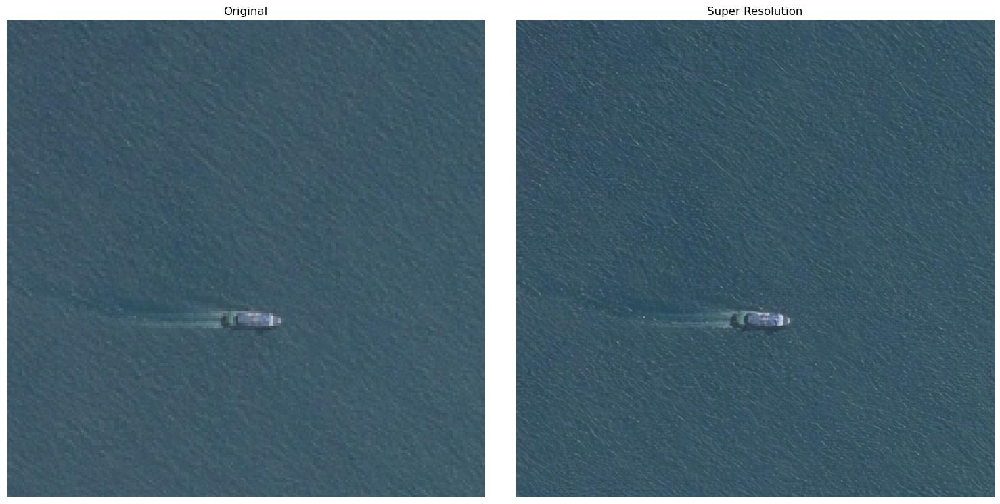
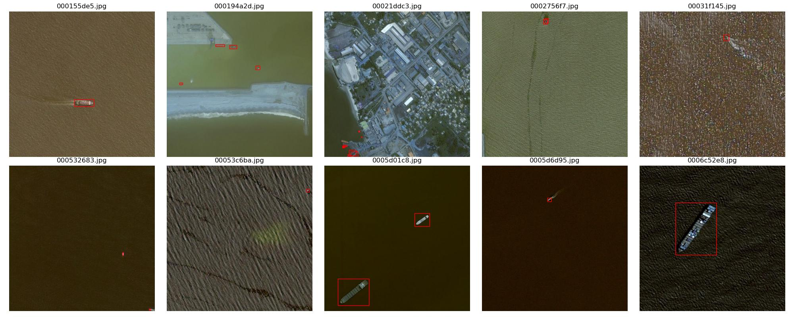
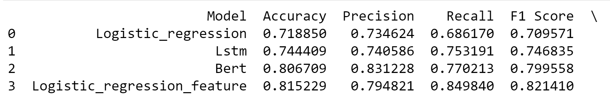
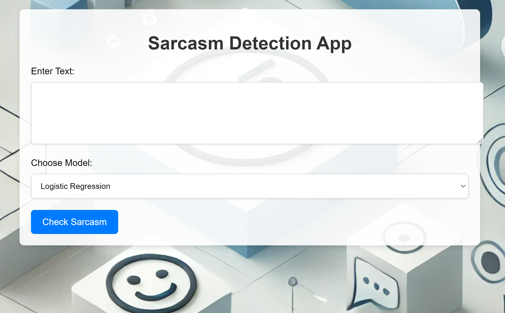
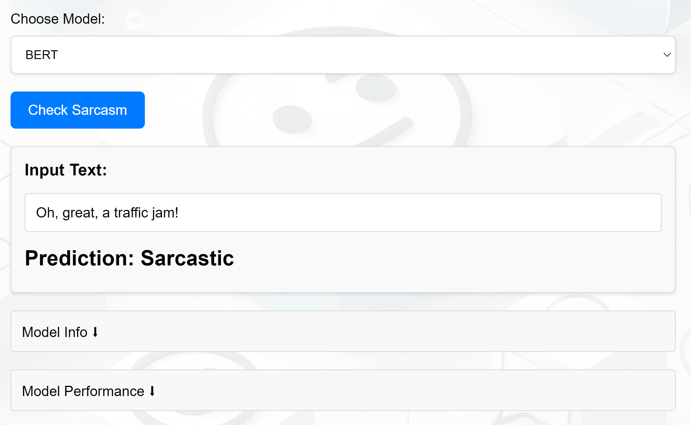
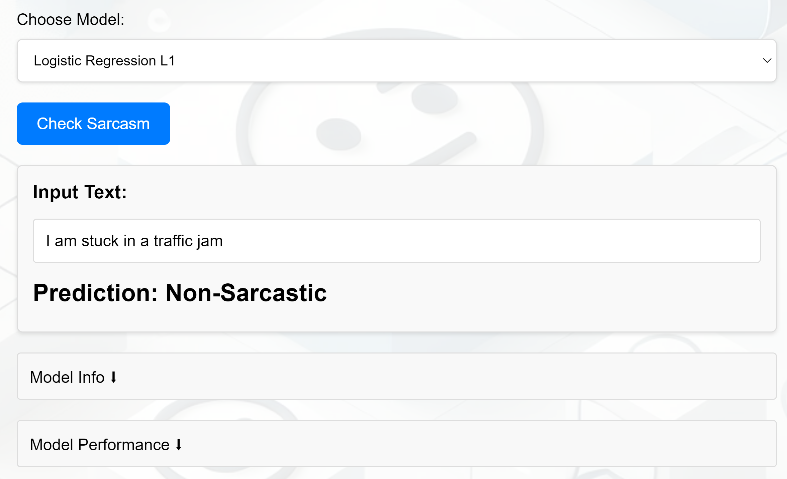
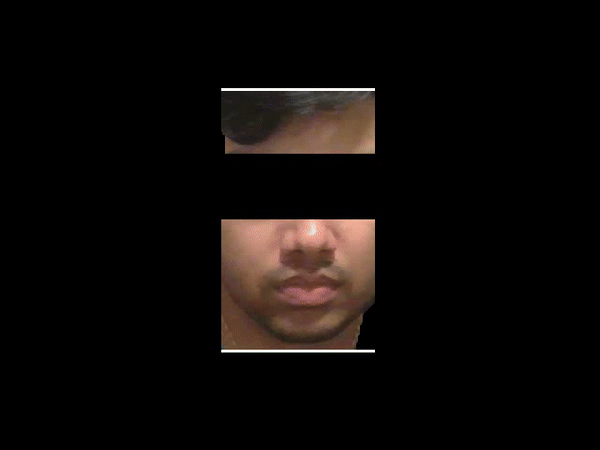
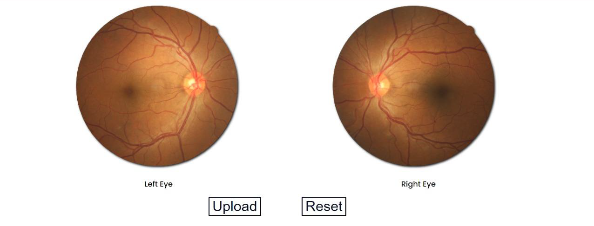
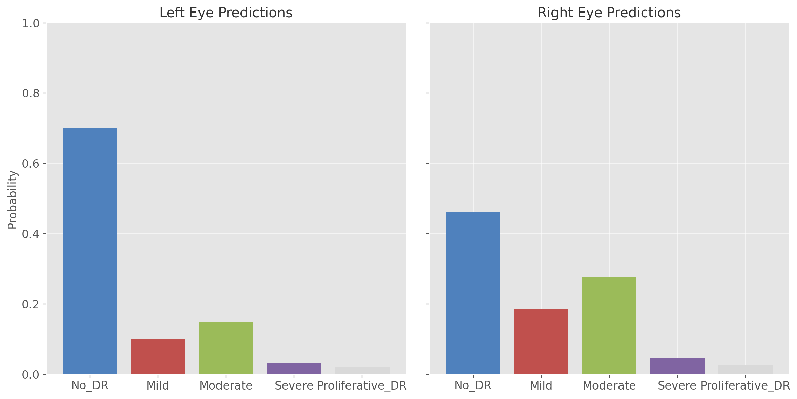

## Proficiencies

**Programming Languages:** , , 

**Machine Learning & AI:** , , , , 

**Data Visualization:** , , , , 

**Big Data & Databases:** , , 

**MLOps & Cloud:** , , , 

**Development Tools:** , , , 

**Advanced Analytics:** Predictive Modeling, Recommender Systems, Time Series Analysis, Natural Language Processing, Text Mining, Feature Engineering

## Projects
### Enhanced Ship Detection through Deep-Learning-Based Super-Resolution Embedding

**Description:**
This project focuses on improving ship detection in satellite and aerial imagery through the use of deep learning-based super-resolution techniques. The approach integrates the Enhanced Super-Resolution Generative Adversarial Network (ESRGAN) to enhance image quality, allowing for finer detection of smaller ships. Following the super-resolution process, YOLOv5 is used for ship identification, ensuring high accuracy and real-time processing, crucial for maritime applications like safety and traffic management.

**Challenges Solved**:
- Enhanced image quality for small object detection.
- Improved detection with the use of YOLOv5.
- Applied attention mechanisms for accurate ship detection in cluttered maritime environments.

**Results:**

**Skills Used:**

, , , 

**GitHub Repository:** <a href="https://github.com/satvikp221b/Ship-Detection-Super-Res" target="_blank">Link to Project Repo</a>

### Sarcasm Detection

**Description:**
This project aims to detect sarcasm in text using a combination of deep learning models, including Logistic Regression, LSTM, and BERT. The project features a web application where users can input text and receive sarcasm predictions. In addition to textual analysis, the model incorporates several additional features, such as the words count, punctuation marks, and sentiment analysis using TextBlob.

**Challenges Solved**:
- Accurate sarcasm detection using modern deep learning techniques.
- Use of additional features like polarity, punctuation marks, capitalization of words, tonal shift.
- Built a Flask-based web application for sarcasm prediction for a smoother interface where model switching can be quick b/w Logistic Regression, LSTM, BERT and Lasso LR.

**Results:**

| Model Metrics | Web App Home Page |
| -------------- | --------------- |
|  |  |

| Sarcasm Detected | No Sarcasm Detected |
| ------------------- | ------------------- |
|  |  |

**Skills Used:**

, , , , , 

**GitHub Repository:** <a href="https://github.com/satvikp221b/Sarcasm-Detector-NLP" target="_blank">Link to Project Repo</a>

### Heartbeat Detection from Video

**Description:**
This project focuses on detecting heart rate from video using advanced computer vision techniques and signal processing. Initially developed during the last semesters of college, the project has been enhanced with recent improvements like Auto Correlation, MTCNN face detection, and averaging frames for better heart rate calculation. The method is based on Photoplethysmography (PPG), which captures subtle changes in skin color corresponding to the cardiac cycle. The project includes Eulerian Video Magnification (EVM) to amplify these subtle changes, making it possible to calculate heart rate accurately from video input.

**Challenges Solved**:
- Achieved non-contact heart rate detection with an error margin of ±5 bpm under ideal conditions.
- Enhanced face detection by incorporating MTCNN, improving the reliability of ROI segmentation.
- Replaced FFT with Auto Correlation for more stable heart rate signal detection.

**Results:**

| Processed Video | Heart Rate Overlay |
| --------------- | ------------------ |
|  |  |

**Skills Used:**

, ,  

**GitHub Repository:** <a href="https://github.com/satvikp221b/Heartbeat-Detection-Using-Video" target="_blank">Link to Project Repo</a>

### Computer Interactive Graphics Projects

**Description:**
This collection showcases my work in the **Computer Interactive Graphics course** at the **University of Illinois Urbana-Champaign (UIUC)**. These projects cover various aspects of computer graphics, such as animation, terrain generation, camera controls, physics-based simulations, and ray tracing. Each project explores different techniques and tools for creating dynamic and interactive graphics.

**Skills Used:**
, , , , 

For more details on each project, [Click here to view the full project descriptions and demos](project/Interactive_graphics.md).

### Diabetic Retinopathy Detection Using Deep Learning

**Description:**
This project focuses on detecting Diabetic Retinopathy (DR) using deep learning techniques applied to retinal fundus images. The approach begins with extensive image preprocessing, followed by the development of three models for DR classification:
- **Model 1 (Custom CNN - EyeNet):** A custom CNN built from scratch, though it achieved moderate accuracy, it was eventually replaced by pre-trained models.
- **Model 2 (Pre-trained CNNs):** Utilized several pre-trained models like AlexNet, VGGNet, ResNet, and GoogleNet. These models were fine-tuned and hyperparameters were adjusted to improve performance but encountered overfitting issues.
- **Model 3 (Ensemble):** The final solution, an ensemble of ResNet50, InceptionV3, Xception, DenseNet121, and DenseNet169, provided the best results, balancing accuracy and recall across all DR severity stages.

The project is integrated into a Flask-based web application, allowing users to upload retinal images and receive real-time predictions on the severity of DR, making it accessible for early diagnosis in resource-constrained environments.

**Challenges Solved**:
- Class imbalance in the dataset was handled through data augmentation.
- Overcame overfitting in deep learning models by using an ensemble approach.
- Achieved high accuracy for classifying DR severity into five distinct stages, allowing for early detection and intervention.

**Results:**

**Skills Used:**

, , , , 

**GitHub Repository:** <a href="https://github.com/satvikp221b/Diabetic-Retinopathy-Deep-Learning" target="_blank">Link to Project Repo</a>

### Recommender Systems - MovieLens Dataset

