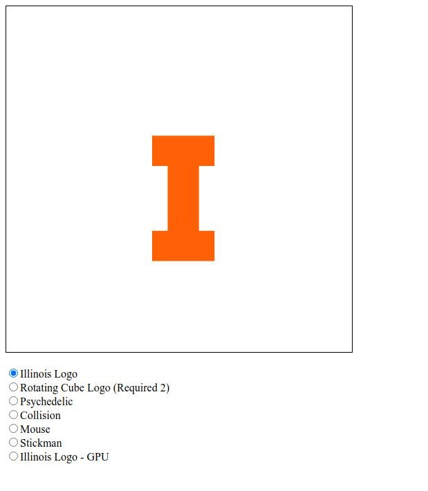
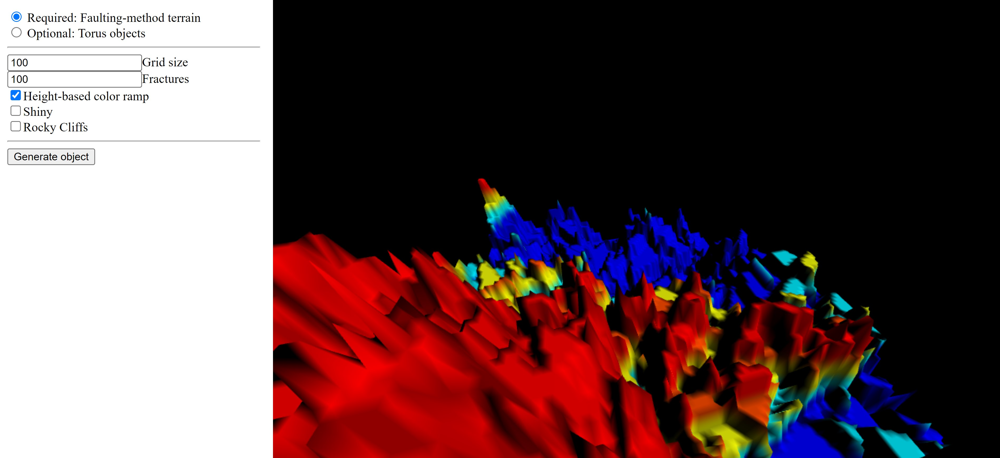
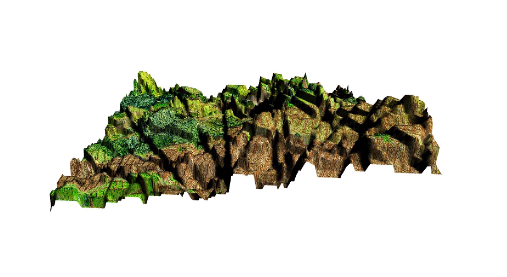
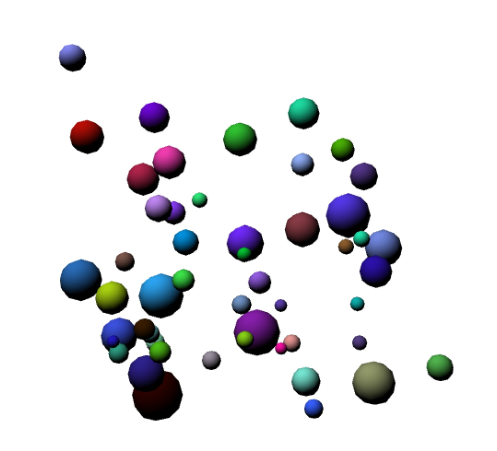
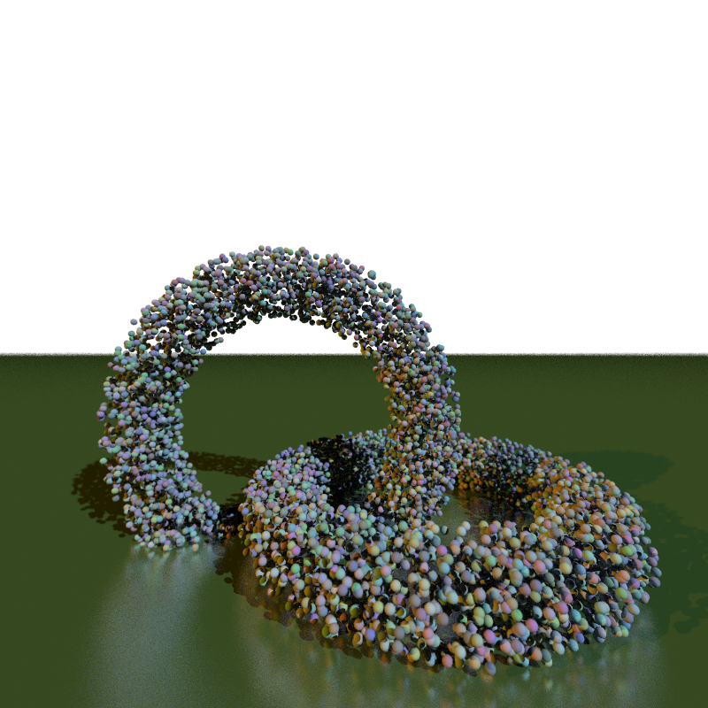

# Detailed Project Descriptions for Computer Interactive Graphics Projects

These projects were completed as part of the **Computer Interactive Graphics course** at the **University of Illinois Urbana-Champaign (UIUC)**. Below, you’ll find detailed explanations of each project, including what I implemented and the challenges solved.

## 1. **Dancing Illinois Logo and Similar Animations**

   In this project, I created an animated version of the Illinois logo using WebGL. The animation includes various effects such as rotation, movement, and size changes of the logo. Users can switch between different animations like rotating cubes and psychedelic patterns using radio buttons. The animations are rendered smoothly using a time-varying matrix for transformations. This project helped me understand how to manipulate 2D objects in a canvas using WebGL while responding to user inputs.

   Results
   
   
   
   <a href="https://satvikp221b.github.io/Computer-Interactive-Graphics/MP2.html" target="_blank">View Project Demo</a>

## 2. **Terrain Generation and Torus**
   
   This project involved generating fractal terrain using the faulting method, allowing users to interact with and explore the generated terrain. The grid size and number of faults can be adjusted to modify the terrain, ensuring it remains visually interesting with realistic vertical and horizontal separations. Additionally, I implemented a torus model with parameters for controlling the number of rings, points per ring, and puffiness. This project helped me explore 3D model generation and handling user-customizable parameters for creating geometries.

   Results
   
   
   
   <a href="https://satvikp221b.github.io/Computer-Interactive-Graphics/MP3.html" target="_blank">View Project Demo</a>

## 3. **Camera and Vehicle Movement on Terrain**
   **Description**:  
   Building on the terrain generation project, I added camera controls and vehicular movement. Users can navigate the terrain either in flight mode or on-the-ground mode, with the camera adjusting smoothly to the terrain’s height. The vehicular movement mode keeps the camera at a fixed altitude above the ground, simulating a vehicle driving over the terrain. This assignment required a deep understanding of camera transformations, movement mechanics, and smooth transitions between different modes of movement. Use W,A,S,D for camera movement and arrow keys for pitch movement. Press F for fog effect and G for vehicular movement.

   Results
   
   
   
   <a href="https://satvikp221b.github.io/Computer-Interactive-Graphics/MP4.html" target="_blank">View Project Demo</a>

## 4. **Spheres and Fireworks Simulation**
   
   In this project, I simulated a system of 50 spheres inside an invisible bounding box. The spheres move according to realistic physics principles, including momentum, gravity, and drag. They also bounce off the walls and collide with each other, with collisions handled based on their mass and radii. Additionally, I created a fireworks display, where particles explode outward, using additive blending to create glowing and overlapping visual effects. This project demonstrated my ability to handle physics-based interactions and particle systems.

   Results
   
   
   
   <a href="https://satvikp221b.github.io/Computer-Interactive-Graphics/burst.html" target="_blank">View Project Demo - Spheres</a>

   <a href="https://satvikp221b.github.io/Computer-Interactive-Graphics/fireworks.html" target="_blank">View Project Demo - Fireworks</a>

## 5. **Raytracer**
   **Description**:  
   The raytracing project was the most advanced, where I implemented a raytracer that calculates the intersection of rays with objects such as spheres and planes. The raytracer supports various lighting models, including multiple suns, point lights (bulbs), and shadows. I also implemented texture mapping, anti-aliasing, fisheye lenses, panoramic views, and depth of field effects. This project challenged me to optimize ray-object intersection logic and improve the visual realism of rendered scenes.

   Results
   
   
   
   <a href="https://github.com/satvikp221b/Computer-Interactive-Graphics/tree/main/Raytracer" target="_blank">Link to Project Repo</a>

---
